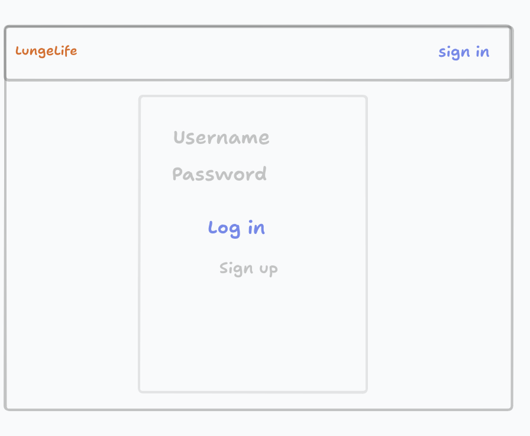
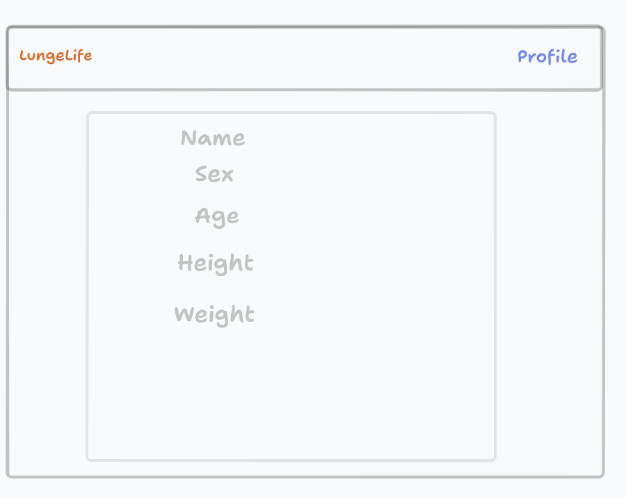
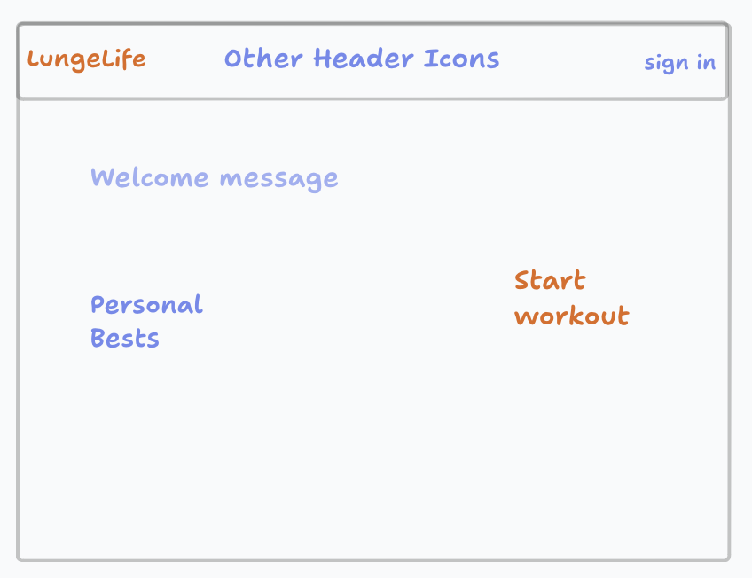
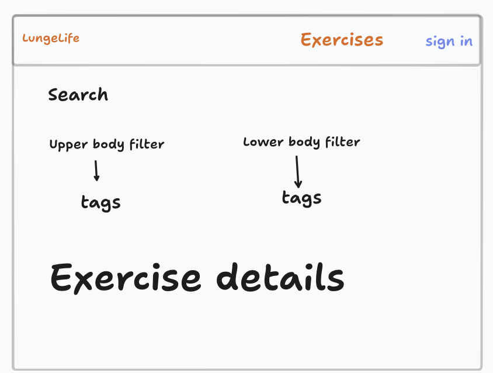
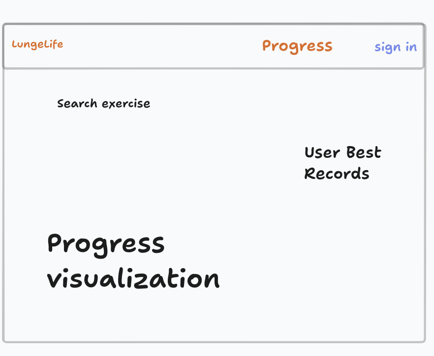
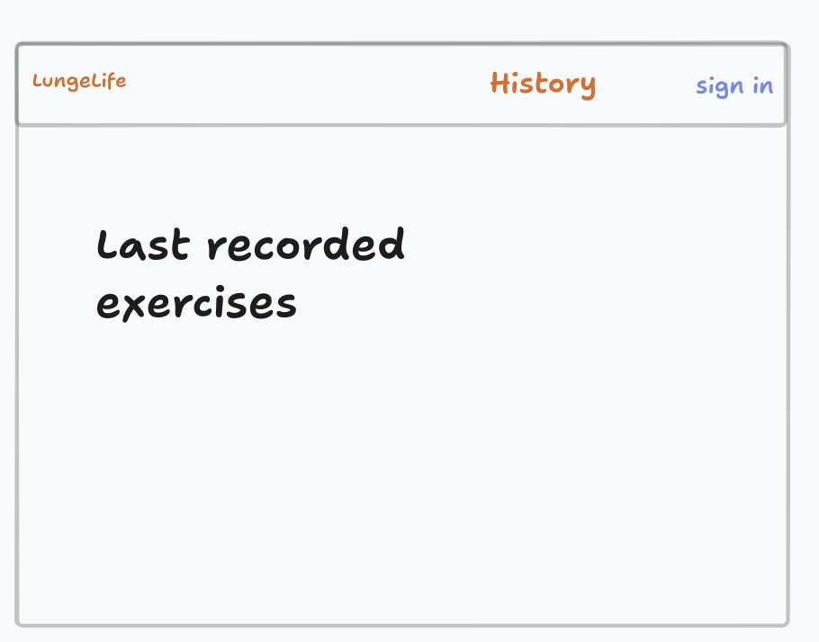
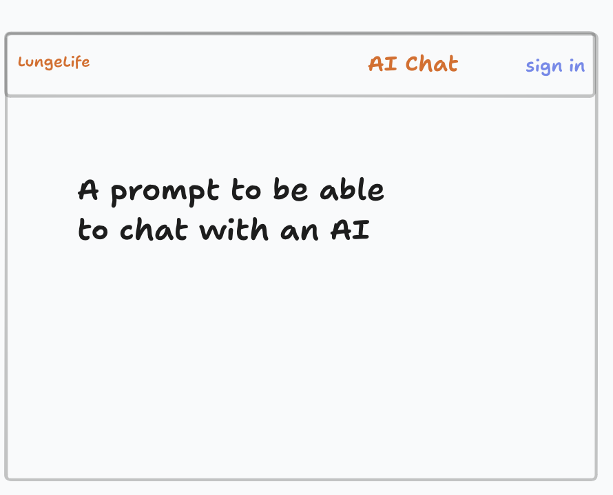
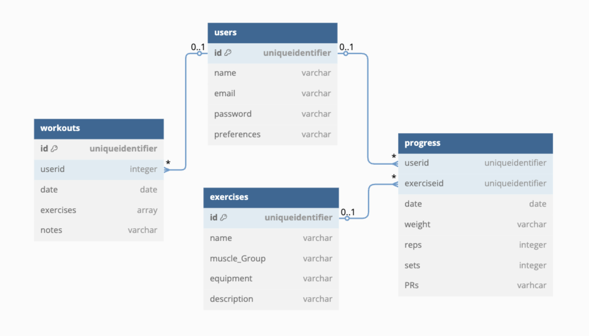

# Project Title

LungeLife

## Overview

LungeLife is a workout tracking platform that helps users log exercises, track progress with visualizations, and receive AI-powered workout recommendations.

### Problem Space

Many fitness enthusiasts struggle with tracking their progress, optimizing their workouts, and staying motivated. Existing solutions often lack intelligent recommendations or customized insights based on user performance. This app aims to provide an intuitive and data-driven way to log workouts, visualize improvements, and receive AI-driven workout suggestions.

### User Profile

Who? Gym-goers, athletes, and fitness enthusiasts of all levels.

How? Users will log their workouts, track progress, and receive AI-based recommendations for future sessions.

Special Considerations: The app will support a simple, fast input method for logging workouts, offer clear visual insights, and integrate an AI assistant for personalized guidance.

### Features

- **Workout Logging:** Users can input exercises, weight, sets, and reps.
- **Progress Visualization:** Graphs and charts track performance over time.
- **Exercise Library:** A searchable database of exercises with details.
- **Personal Best Tracking:** Highlights PRs and milestones.
- **Tagging System:** Organize workouts with tags for better tracking.
- **AI Chat Assistant:** Ask fitness-related questions directly in the app.
- **AI-Powered Recommendations:** Machine learning suggests optimal weights for upcoming workouts.

## Implementation

### Tech Stack

- **Frontend:** React, React Hooks, SCSS for styling

- **Backend:** Node.js, Express.js

- **Database:** MySQL for workout and user data

- **Machine Learning:** TensorFlow.js or a Python-based ML model via Flask API

- **Deployment:** Notify (Frontend), Heroku (Backend)

- **Libraries:** Chart.js (for data visualization), Axios (for API calls)

### APIs

https://api-ninjas.com/

Local API

### Sitemap

🏠 Home: Best Records and Button to Start Workout
🏋️‍♂️ Exercises: Search/Filter exercises with details
📊 Progress: Charts and Personal best tracking
📜 History: List of past workouts with search options
👤 Profile: User details, goals, and preferences
💬 AI Chat Assistant: Chat window for fitness guidance

### Mockups

### Data

### Endpoints

**/api/workouts :** GET to Fetch user workouts and POST to add new workout
**/api/workouts/:id :** GET to Fetch a single workout by ID
**/api/history :** GET to Fetch workout history
**/api/exercises :** GET to fetch exercise library
**/api/progress :** GET to get progress data and POST to Log progress Data
**/api/chat :** POST to Send query to AI assistant
**/api/profile/:id :** GET to Fetch user details
**/api/profile/:id :** POST to add new user and their details
**/api/profile/:id :** PUT to update user profile

## Roadmap

Day 1-2: Project Setup & Core Structure
✅ Set up React (frontend) and Express (backend)
✅ Design database schema (PostgreSQL or MongoDB)
✅ Create basic API routes for workouts, exercises, and user data

Day 3-5: Core Features Implementation
✅ Workout Logging – Form to add exercises, weight, sets, and reps
✅ Workout History – Fetch and display past workouts
✅ Exercise Library – Searchable list of exercises

Day 6-7: Enhancements
✅ Progress Visualization – Basic Chart.js graphs for tracking progress
✅ Personal Best Tracking – Highlight PRs

Day 8-9: AI & ML Features (if time allows)
✅ Machine Learning for Weight Suggestions (Basic logic, no complex model)
✅ AI Chat Assistant (Use OpenAI API or mock simple responses)

Day 10: Testing & Final Touches
✅ Bug fixes, small UI improvements, and final presentation

---

## Future Implementations

💡 User Authentication – Allow users to sign up, log in, and store their data securely.
💡 Dark Mode & Custom Themes – Allow users to customize the app’s look.
💡 Workout Sharing – Let users share their workouts with friends or on social media.
💡 Advanced Machine Learning for Predictions – Improve AI-based weight suggestions by learning from past performance trends.
💡 Wearable Integration – Sync with Apple Watch, Fitbit, or other devices for real-time tracking.
💡 Voice Commands – Enable users to log workouts hands-free using voice input.
💡 Exercise Feedback – Use computer vision (e.g., PoseNet) to analyze movement and suggest corrections.
